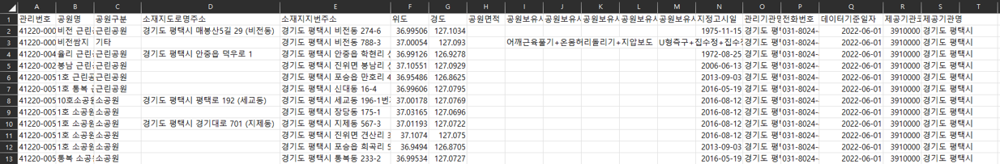
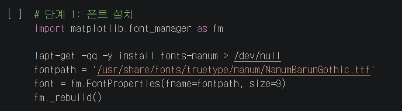
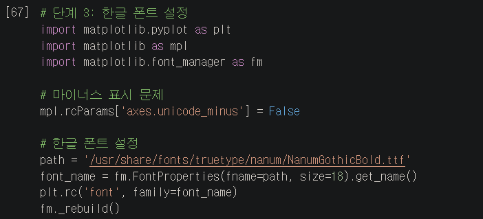
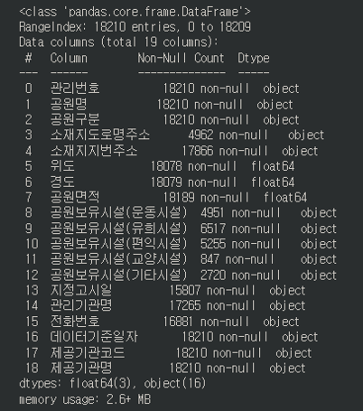
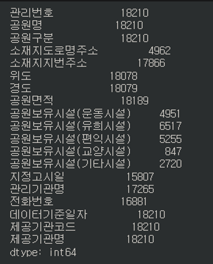
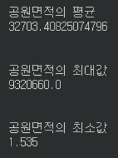

# 도시녹지환경 빅데이터 요약분석

  
## 01. 프로젝트 개요

도시 공원이란? 
- 도시 자연 경관의 보호와 시민의 건강, 휴양 및 정서생활의 향상에 기여함을 목적으로 조성, 관리하는 공원

  
## 02. 프로젝트 설계

- 사용 언어: Python
- 개발 환경: Google Colaboratory(https://colab.research.google.com )
- 데이터 수집 방법: 공공데이터 포털(https://www.data.go.kr)
- 사용하는 데이터: 전국 도시 공원 정보 표준 데이터
  

  
## 03. 프로젝트 분석

### 03-1. 한글 폰트 설정

> ### 폰트 설치하기  
>     
>
> ### 런타임 재시작  
>     
>
> ### 한글 폰트 설정 및 마이너스 표시 문제 해결  
>     

### 03-2. 데이터 전처리

> ### info() 함수 이용한 정보 확인 
> 
> - 단순 공원명 뿐만 아니라 공원의 종류를 세분화하며 도로면과 지번 주소 모두 표기하는 것을 확인할 수 있다.
> - 공원의 면적과 공원이 보유하고 있는 시설이 무엇인지 (운동, 유희, 편익, 교양, 기타)를 알 수 있다.
> - 관리하는 기관명과 전화번호를 통해 추후 문의사항 등과 관련하여 연락할 수 있다.
>
> ### count() 함수 이용한 데이터 개수 확인 
> 
> - 관리번호, 공원명, 공원구분의 데이터 개수를 통해 현재 우리나라의 도시공원이 총 18,210개 있음을 알 수 있다.
> - 현재 우리나라 도시공원은 4,951곳의 운동시설, 6,517곳의 유희시설, 5,255곳의 편익시설, 
    847곳의 교양시설, 2720곳의 기타 시설을 보유하고 있으며 유희시설을 가장 많이 보유하고 있음을 알 수 있다.
>
> ### 통계함수(mean(),max(),min()) 이용한 공원 면적 확인 
> 
> 우리나라 공원 면적의 평균은 대략 32,703㎡이며
    가장 큰 공원의 면적은 대략 9,320,660㎡이다
    또한 가장 작은 공원의 면적은 대략 1㎡이다

