# 도시녹지환경 빅데이터 요약분석

  
## 01. 프로젝트 개요

도시 공원이란? 
- 도시 자연 경관의 보호와 시민의 건강, 휴양 및 정서생활의 향상에 기여함을 목적으로 조성, 관리하는 공원
 

도시 공원의 필요성
- 시민에게 여가휴식 공간 제공 
-> 우리나라 인구의 90%가 모여 살고있는 도시에서 자연의 숨결과 삶의 여유를 찾을 수 있는 곳
- 이산화탄소 흡수, 신선한 산소 배출 
-> 느티나무 1그루는 하루 8시간 광합성 작용을 할 경우 연간 이산화탄소 2.5톤을 흡수하고, 1.8톤의 산소 방출
- 기후 완화 
-> 숲은 여름 한 낮의 평균 기온을 3~7도 완화시키고, 습도는 9~23% 상승시키는 등 친자연적인 기후조절 기능으로 쾌적한 생활환경 제공
- 미세먼지 저감 및 홍수 방지 
-> 숲은 연간 미세먼지 46kg을 포함한 대기오염 물질 168kg을 흡착, 흡수하고 빗물을 머금어 홍수 예방

  
## 02. 프로젝트 설계

- 사용 언어: Python
- 개발 환경: Google Colaboratory(https://colab.research.google.com )
- 데이터 수집 방법: 공공데이터 포털(https://www.data.go.kr)
- 사용하는 데이터: 전국 도시 공원 정보 표준 데이터
  

   
## 03. 프로젝트 분석

### 03-1. 한글 폰트 설정

> ### 1) 폰트 설치하기
>     
>
> ### 2) 런타임 재시작 
>     
>
> ### 3) 한글 폰트 설정 및 마이너스 표시 문제 해결 
> 
>
  

### 03-2. 데이터 전처리

> ### 1) info() 함수 이용한 정보 확인
>  
> - 단순 공원명 뿐만 아니라 공원의 종류를 세분화하며 도로면과 지번 주소 모두 표기하는 것을 확인할 수 있다.
> - 공원의 면적과 공원이 보유하고 있는 시설이 무엇인지 (운동, 유희, 편익, 교양, 기타)를 알 수 있다.
> - 관리하는 기관명과 전화번호를 통해 추후 문의사항 등과 관련하여 연락할 수 있다.
>
> ### 2) count() 함수 이용한 데이터 개수 확인
>  
> - 관리번호, 공원명, 공원구분의 데이터 개수를 통해 현재 우리나라의 도시공원이 총 18,210개 있음을 알 수 있다.
> - 현재 우리나라 도시공원은 4,951곳의 운동시설, 6,517곳의 유희시설, 5,255곳의 편익시설, 
    847곳의 교양시설, 2720곳의 기타 시설을 보유하고 있으며 유희시설을 가장 많이 보유하고 있음을 알 수 있다.
>
> ### 3) 통계함수(mean(),max(),min()) 이용한 공원 면적 확인
>  
> - 우리나라 공원 면적의 평균은 대략 32,703㎡이며가장 큰 공원의 면적은 대략 9,320,660㎡이다.
> - 또한 가장 작은 공원의 면적은 대략 1㎡이다
>
> ### 4) 공원 면적 결측치 확인
> 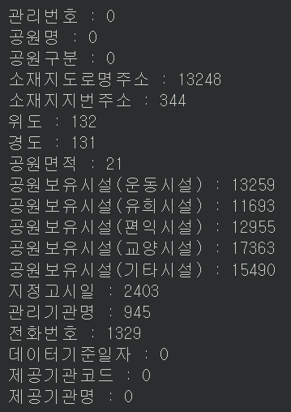 
> - 공원 면적의 NaN 값은 21개이다.
> - 이는 현재 공사중인 도시공원이 21곳이라는 의미이다.
>
> ### 5) 도로명/지번 주소 결측치 확인
> 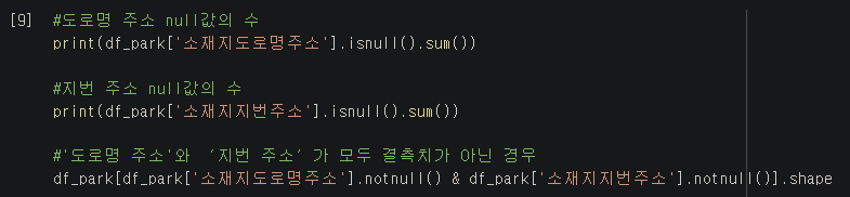 
> - 도로명 주소의 결측치는 13,248이고 지번 주소의 결측치는 344이다.
> - 우리나라 공원 18,210개 중 도로명 주소와 지번 주소를 모두 알 수 있는 공원은 총 4,618개이며 전체의 약 1/4정도다.
>
> ### 6) drop_duplicates() 이용한 공원구분 중복 데이터 처리
> 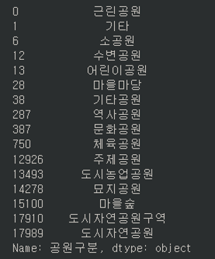 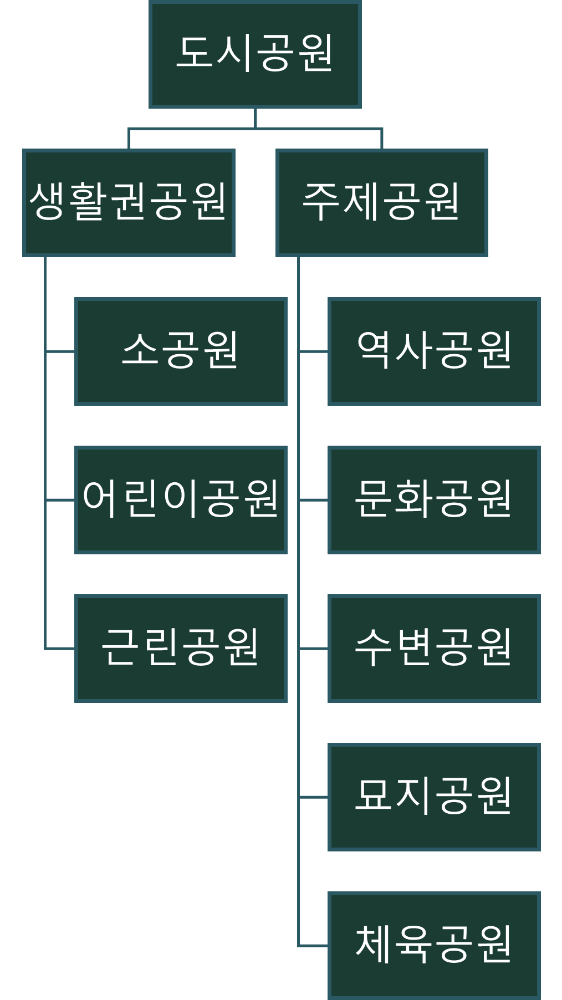 
> - 현재 우리나라는 공원을 위와 같이 구분한다. 
> - 데이터 값을 통해 공공데이터 포털은 마을마당, 도시 농업공원 등 조금 더 세분화하여 공원을 구분하였음을 할 수 있다.
>
> ### 7) 각 지역 별 공원 수
> >
> ### split() 함수 이용한 소재지도로명주소를 '시'별로 나누기
> 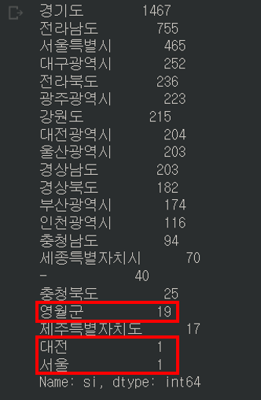 
> - 데이터 값을 통해 영월군, 대전, 서울과 같이 데이터가 정확하게 나누어지지 않았음을 확인 할 수 있다.
> 
> ### replace() 함수 이용한 같은 지역으로 묶기
> 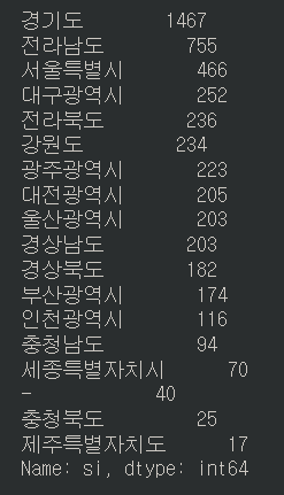 
> - 데이터 값을 통해 각 지역별 공원 분포도를 알 수 있으며 경기도가 1,467개로 가장 많고, 제주도가 17개로 가장 적음을 알 수 있다.
>
  

### 03-3. 전국 공원 분포도 시각화

> ### 1) 위도, 경도를 이용하여 전국 공원 분포도 시각화하기
> 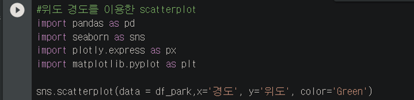  
> - 우리나라 위도, 경도에서 벗어난 부분이 있음을 확인 할 수 있다.
>
> ### 2) 위도, 경도 재조정 후 전국 분포도 시각화하기
> 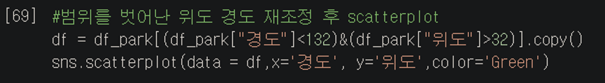 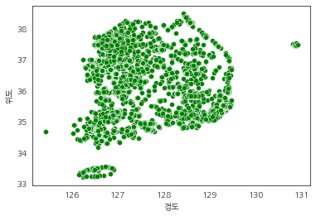 
> - 우리나라 위도, 경도를 고려하여 경도가 132 이하이고 위도가 32이상인 데이터만 추출하여 데이터의 정확도를 높여 scatterplot() 함수를 이용하여 전국 공원 분포도를 시각화 한다.
>
> ### 3) '공원구분'별 전국 공원 분포도 시각화하기
> 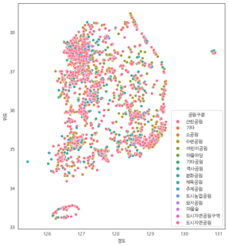 
> - 공원구분별 전국 공원 분포도를 scatterplot() 함수를 이용하여 시각화 한다.
> -  분포도를 통해 근린공원이 가장 많음을 확인할 수 있다.
>
> ### 4) '시'별 전국 공원 분포도 시각화하기
> 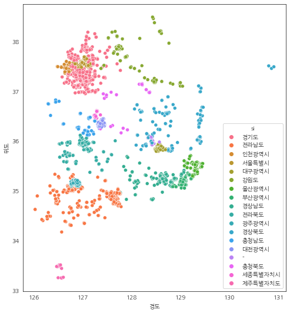 
>
> ### 5) '연도'별 공원 수 시각화하기
> 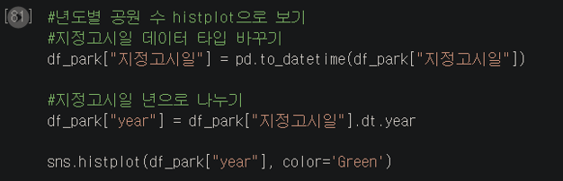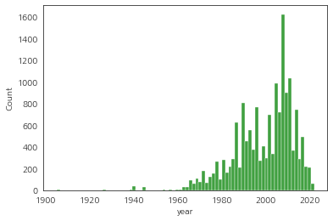 
> - 지정고시일 데이터 타입이 3-1을 보면 object임을 확인 할 수 있다.
> - 지정고시일 데이터 타입을 to_datetime() 함수를 이용하여 object에서 datetime으로 바꾼다.
> - 지정고시일 데이터를 dt.year을 이용하여 년도로 나눈다.
> -  histplot() 함수를 이용하여 연도별 공원 수를 시각화한다.
> -  시각화한 자료를 통해 2010년쯤 지어진 공원이 가장 많음을 알 수 있다.
>
> ### 6) 지도 위의 시각화
> 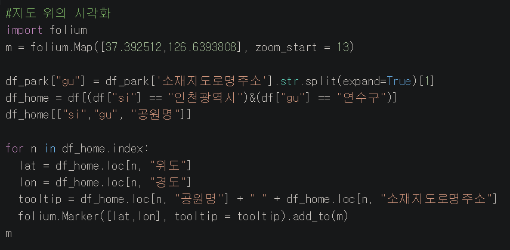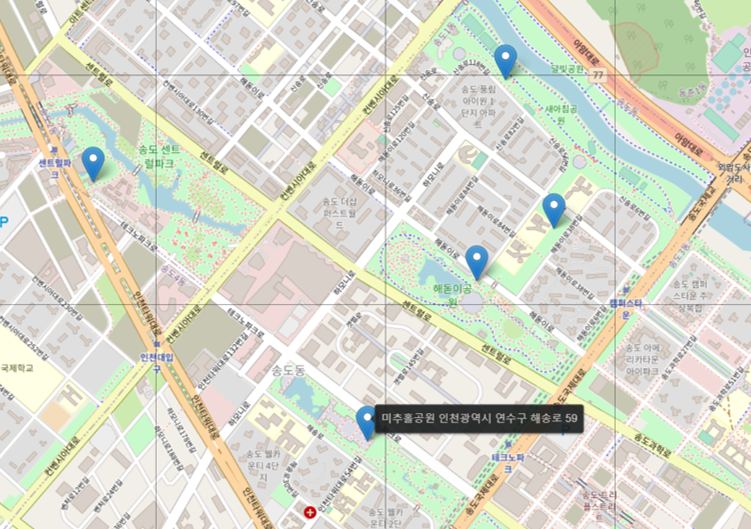 
> - 소재지도로명주소를 '구'별로도 분류한다.
> - folium 라이르러리를 이용하여 지도 위에 시각화한다.

